# Agent Research Release Gates — Design Specification

**Status:** Approved in conversation; written review pending

**Date:** 2026-07-12

**Implementation branch:** `codex/agent-release-gates`

**Isolated worktree:** `/Users/justinetwaru/Projects/Market-Insight-Engine-agent-release-gates`

**Base commit:** `a6eaa8809727b35126f931379cab2c8848692a17`

## 1. Decision summary

Market-Insight-Engine will gain one integrated, fail-closed control plane for the new
agent-generated research packets. It will:

1. authenticate every application API request except the two health checks;
2. distinguish permanent human, service, and agent principals;
3. freeze the complete model, prompt, skill, manifest, tool, policy, and code identity for every
   run;
4. persist complete redacted model/tool traces, usage, computed cost, latency, retries, errors, and
   evidence lineage;
5. keep adjudicated training and evaluation cases in the Supabase operational brain;
6. test each release fingerprint five consecutive times against every golden case, with
   deterministic, opposing-provider, and human grading;
7. keep publication disabled until deterministic thresholds pass and a human signs an approval in
   the protected Desk review panel.

This is a release gate for **new agent-generated research packets**. It is not a market gate and it
does not change when deterministic signals fire. The existing scanner, `CopilotEvent`, deterministic
committee lenses, journal, and scoreboard remain available behind API authentication. Research
packets are read-only context beside strategy truth; agents never write signals, gates, scores, risk
values, orders, or broker instructions.

## 2. Current-system truth

The repository has a useful deterministic trading-desk spine, but it does not currently have a
runtime multi-agent research team:

- `copilot-core` owns deterministic features, triggers, gates, risk/reward, and events.
- `copilot-committee` is a synchronous deterministic lens ensemble. Its optional model call can
  rewrite prose but cannot change the structured recommendation.
- The API is currently unauthenticated.
- Request logs exist, but durable model/tool traces, cost, version fingerprints, and evidence
  lineage do not.
- The existing history, journal, and report tables are mutable product state, not an append-only
  research audit plane.
- Fixture mode is still exposed in existing Desk/OpenAPI paths, although `/analyze` now fails
  closed without live data. Historical fixtures must become labeled brain cases; they must never
  masquerade as current live truth.

The design keeps the deterministic spine and adds the smallest real research slice:

```text
CandidateSeed
  -> Market Research Lead
  -> Catalyst Verifier
  -> Source Guardian
  -> deterministic completeness and release policy
  -> CandidatePacket in SHADOW or PUBLISHABLE state
  -> read-only context beside CopilotEvent
```

Macro and capital-structure specialists remain deferred. They may be added only after the initial
slice demonstrates a distinct contract, source set, permission boundary, and evaluation need.

## 3. Isolation and change boundary

All work occurs in the separate worktree and branch named above. The source checkout, its running
server, its modified `pnpm-lock.yaml`, and its untracked `.env` are not edited.

The new worktree receives a local `supabase/` directory with versioned SQL and tests. Creating and
testing local migrations is approved. Applying any SQL or other mutation to the remote Supabase
project requires a separate, explicit approval immediately before the mutation. No implementation
phase may infer remote-mutation approval from approval of this document.

Provider credentials remain runtime configuration. They are not copied into source, migrations,
fixtures, traces, evidence payloads, or commits.

## 4. System architecture

```mermaid
flowchart LR
    H[Human principal\nDesk operator] -->|Bearer credential| API[Express API\nauthentication + authorization]
    S[Service principal\nAPI worker/eval runner] -->|Bearer or in-process identity| API
    A[Agent principal\nmanifest-bound] -->|scoped in-process invocation| RUN

    API --> AUTH[(Supabase brain\nprincipals + credential hashes)]
    API --> RUN[Research run coordinator\ncode-controlled state machine]

    RUN --> SIP[Alpaca SIP\nmandatory live preflight]
    RUN --> FMP[FMP\nonly when task manifest requires it]
    RUN --> OA[OpenAI Responses API]
    RUN --> AN[Anthropic Messages API]
    RUN --> SRC[Primary-source tools\nSEC / issuer IR / regulator]

    OA --> TRACE[(Append-only traces\nusage + cost + retries)]
    AN --> TRACE
    SIP --> TRACE
    FMP --> TRACE
    SRC --> EVID[(Evidence objects + lineage)]
    TRACE --> RUNDB[(Research runs +\nversion snapshots)]
    EVID --> RUNDB

    RUNDB --> EVAL[Evaluation runner\n5 consecutive trials]
    BRAIN[(Training / validation /\nhidden holdout cases)] --> EVAL
    EVAL --> CG[Deterministic code grader]
    EVAL --> XG[Opposing-provider model grader]
    CG --> REVIEW[Protected Desk review panel]
    XG --> REVIEW
    REVIEW -->|signed human decision| DEC[(Append-only decisions)]
    DEC --> PUB{Publication gate}
    PUB -->|approved fingerprint only| PACKET[Agent research packet]
    PUB -->|otherwise| SHADOW[Shadow result only]
    PACKET -. read-only context .-> EVENT[CopilotEvent / deterministic desk]
```



### Why the loop remains application-controlled

The runtime uses the official OpenAI and Anthropic SDKs behind one provider-neutral interface, but
the application owns orchestration. A manual, code-controlled loop is required because this system
must enforce provider preflights, tool scopes, complete custom tracing, deterministic stop reasons,
opposing-provider grading, and explicit human publication approval. Hosted autonomous agent loops
would make these boundaries harder to prove and are not required for the initial three-agent slice.

Every consequential capability is a dedicated typed tool. Agents do not receive shell, database
DDL, unrestricted HTTP, broker, order, email, filesystem, or arbitrary browser tools. The harness,
not the model, validates every tool argument and permission.

## 5. Principals, credentials, and API protection

### 5.1 Principal types

```ts
type Principal =
  | { kind: "human"; principalId: string; subject: string; scopes: string[] }
  | { kind: "service"; principalId: string; subject: string; scopes: string[] }
  | {
      kind: "agent";
      principalId: string;
      subject: string;
      servicePrincipalId: string;
      manifestId: string;
      manifestVersion: string;
      scopes: string[];
    };
```

Supabase publishable, secret, anon, and service-role keys are infrastructure credentials. Alpaca,
FMP, OpenAI, and Anthropic keys are provider credentials. None of these establishes a human,
service, or agent application identity.

### 5.2 Permanent application credentials

Application API credentials have no required expiry. Their issuance rows store a lookup prefix, a
versioned peppered one-way digest of the high-entropy secret, principal binding, and creation
metadata.
Plaintext application secrets are shown only when created and are never recoverable from the
database. Effective status is resolved from the active leaf of the serialized credential-decision
chain, so
revocation does not mutate the issuance row.

"Permanent" means `expires_at` may remain `NULL`; it does not remove the ability to revoke a
compromised credential or create a replacement. Revocation is an append-only governance action.

Agent credentials are bound to exactly one active manifest version and one owning service
principal. Effective permission is the intersection of:

```text
credential scopes INTERSECT principal scopes INTERSECT manifest tool/scope allowlist
```

Caller-supplied headers may not override principal kind, subject, service owner, manifest ID, or
manifest version.

### 5.3 Protected routes

Only these endpoints are public:

- `GET /api/healthz`
- `GET /api/copilot/healthz`

They return shallow process health only and expose no provider, database, entitlement, principal,
or version details. Every other `/api` endpoint requires authentication. Authorization then applies
route-specific scopes.

Initial scopes:

| Scope | Typical principal | Capability |
|---|---|---|
| `desk:read` | human, limited service | Read existing Desk data and agent review summaries |
| `scan:refresh` | human, scheduler service | Spend market-data quota on scan refresh |
| `event:generate` | human, scheduler service | Generate deterministic `CopilotEvent` records |
| `committee:run` | human, scheduler service | Run deterministic committee and optional prose provider |
| `replay:read` | human, eval service | Read explicitly historical replay/practice data |
| `research:run` | human, research service | Start a shadow research run |
| `research:read` | human, research/eval service | Read authorized run summaries and traces |
| `tool:market-data` | scoped agent | Read-only Alpaca SIP market-data tool |
| `tool:fmp` | scoped agent | Declared FMP enrichment endpoints only |
| `tool:primary-source` | scoped agent | Allowlisted primary-source retrieval |
| `evaluation:run` | human, eval service | Start repeated evaluation trials |
| `evaluation:read` | human, eval service | Read authorized evaluation matrix summaries |
| `evaluation:grade` | manifest-bound grader agent | Write an opposing-provider grade |
| `evaluation:holdout-read` | grader agent, eval service | Read only the hidden case fields required for grading |
| `learning:candidate` | new research agents, eval service | Propose a candidate learning case |
| `learning:decide` | human only | Promote, quarantine, or supersede a case revision |
| `publication:decide` | human only | Approve, reject, relock, or revoke a release/packet decision |
| `governance:credentials` | human only | Issue or revoke principals and permanent application credentials |
| `report:write`, `watchlist:write`, `journal:write` | human only | Existing human product mutations |

In-process jobs receive an explicit service identity. They do not bypass attribution or call the
HTTP API through a shared loopback token.

### 5.4 Normative route policy registry

One code-owned `routePolicyRegistry` is the authorization source for Express and OpenAPI generation.
Every runtime method/path must have exactly one entry declaring public/authenticated status, required
scopes, allowed principal kinds, idempotency requirement, conditional query rules, and resource
predicate. CI compares registered Express routes, OpenAPI operations, and this registry and fails on
an unclassified or mismatched route.

The initial registry contains separate entries for every operation below even where the table groups
similar policies:

| Method and path | Required policy |
|---|---|
| `GET /api/healthz`, `GET /api/copilot/healthz` | Public, shallow response only |
| `POST /api/auth/session` | Valid permanent human bearer; creates browser session |
| `DELETE /api/auth/session` | Authenticated human session; invalidates browser session |
| `GET /api/auth/whoami` | Any authenticated principal; returns only its own effective identity/scopes |
| `GET /api/scan/premarket` | Human/service + `scan:refresh`; idempotency always required because a cache miss spends quota and writes scan state |
| `GET /api/scan/scorecard`, `GET /api/scan/universe-snapshot` | `desk:read`; human or service |
| `POST /api/analyze` | Human + `report:write`; idempotency required; live provider policy applies |
| `GET /api/reports`, `GET /api/reports/:id` | `desk:read`; human or explicitly allowlisted read service |
| `DELETE /api/reports/:id` | Human + `report:write`; idempotency required |
| `GET /api/watchlist` | `desk:read`; human or explicitly allowlisted read service |
| `POST /api/watchlist`, `DELETE /api/watchlist/:ticker` | Human + `watchlist:write`; idempotency required |
| `GET /api/copilot/event` | Human/service + `event:generate`; idempotency required because history is written |
| `GET /api/copilot/explain` | Human/service + `event:generate` + `committee:run`; idempotency required |
| `GET /api/copilot/journal`, `GET /api/copilot/strategies`, `GET /api/copilot/validation`, `GET /api/copilot/scoreboard`, `GET /api/copilot/history` | `desk:read`; human or explicitly allowlisted read service |
| `POST /api/copilot/journal`, `DELETE /api/copilot/journal/:id` | Human + `journal:write`; idempotency required |
| `GET /api/copilot/replay/session`, `GET /api/copilot/replay/event` | Human/eval service + `replay:read`; historical provenance guard |
| `GET /api/copilot/replay/explain` | Human/eval service + `replay:read` + `committee:run`; idempotency required |
| `POST /api/research/runs` | Human/research service + `research:run`; idempotency required |
| `GET /api/research/runs/:runId`, `/traces`, `/evidence` | Human/research service/eval service + `research:read`, then run-mode, partition, ownership, and field-projection predicate; agent principals forbidden |
| `POST /api/evaluation/fingerprints/:fingerprint/trials` | Human/eval service + `evaluation:run`; idempotency required |
| `GET /api/evaluation/fingerprints/:fingerprint/matrix` | Human/eval service + `evaluation:read` + evaluation resource predicate |
| `GET /api/governance/review-queue` | Human + `desk:read`; reviewer field projection |
| case promote/quarantine/supersede routes | Human + `learning:decide`; permanent-key step-up; idempotency required |
| release approve/reject/relock/revoke routes | Human + `publication:decide`; permanent-key step-up; idempotency required |
| principal/credential issue/revoke routes | Human + `governance:credentials`; permanent-key step-up; idempotency required |

Human-only means both `principal.kind === "human"` and the scope must pass. “Typical principal” is
never authorization. Parameter-dependent policies run before the handler and cannot be bypassed by
omitting defaults.

`Idempotency-Key` binds to verified principal ID, OpenAPI operation ID, and canonical query/body
hash. Reuse with the same hash returns the original status/body reference; reuse with a different
hash returns `409 IDEMPOTENCY_CONFLICT`; an in-progress duplicate returns `409
IDEMPOTENCY_IN_PROGRESS`. Operational replay records are retained at least 24 hours; the immutable
request and decision audit remains permanent.

### 5.5 Authentication and authorization records

Before a protected handler runs, the audit store must accept a request row containing request ID,
nullable credential/principal IDs, verified principal kind and effective scopes when authentication
succeeds, route, method, and auth outcome. Completion appends the response status, latency, and error
as a second row linked by request ID. These rows do not require a `ResearchRun`; they may later
correlate to one by nullable `run_id`. Authentication failures avoid revealing whether a credential
prefix or principal exists. If the initial request-audit write cannot be guaranteed, no audit row is
claimed: every protected endpoint fails closed with `503 AUDIT_UNAVAILABLE` and emits only the
process's redacted availability log/metric; the two shallow health checks remain available.

OpenAPI declares bearer authentication or the Desk cookie/CSRF scheme for protected operations,
overrides the two health operations with `security: []`, and documents `401` and `403` separately.
The generated React client already supports a bearer token and will be wired to the Desk's
authenticated session state.

### 5.6 Human session, credential issuance, and signed decisions

The permanent human API credential is never persisted in browser JavaScript storage. On Desk
startup the operator enters it into an in-memory form and calls `POST /api/auth/session` with bearer
authentication. The server returns an opaque browser-session cookie marked `HttpOnly`, `Secure`,
and `SameSite=Strict`; only its digest is stored in `governance.browser_sessions`, bound to the human
principal and credential. The default cookie lifetime is the browser session and does not expire or
revoke the underlying permanent API credential.

Session creation also returns a 256-bit CSRF token in a `mie_csrf` `Secure; SameSite=Strict`
non-HttpOnly cookie and stores its digest on the session row. Unsafe cookie-authenticated requests
must send the same value in `X-CSRF-Token`; the server binds it to the session and compares its
digest in constant time. The CSRF token rotates at session creation and every permanent-key step-up,
and session logout/revocation invalidates both digests. Same-origin `Origin` is also required; CORS
is an explicit same-origin allowlist with credentials enabled. Service callers use bearer
credentials and never receive browser cookies.

`DELETE /api/auth/session` appends a browser-session revocation decision and revokes only that
session. Credential revocation is a separate human governance decision. Consequential case,
release, principal, and credential decisions require step-up by resubmitting the permanent human
bearer credential; an existing browser session alone is insufficient.

The first human principal and credential are created by a one-time local CLI that refuses to run if
an active human credential already exists, inserts through the same audited decision functions, and
prints the plaintext credential once. Running that CLI against remote Supabase is a remote mutation
and therefore requires immediate explicit approval. Later human, service, and agent principal or
credential issuance uses the protected governance endpoints and the same step-up rule.

"Signed human decision" means a step-up-authenticated, server-attested immutable record. The
canonical payload contains decision ID/type/verdict/rationale, typed subject ID and hash, subject
revision, superseded decision ID, release policy hash where applicable, human principal and
credential IDs, request ID, timestamp, and nonce. The server computes an HMAC-SHA-256 attestation
with a versioned decision-attestation key and stores the key ID plus signature. Verification
re-canonicalizes the payload and checks the signature; any field change fails. This attestation
proves record integrity and verified human authorization, while the append-only chain preserves
supersession and revocation.

## 6. New agent roster and model assignment

The Desk review panel shows only the new research and evaluation agents. Existing deterministic
committee lenses are not relabeled as agents and do not appear in the agent-release panel.

| New principal | Role | Tools/data | Learning access | Prohibited |
|---|---|---|---|---|
| `market-research-lead` | Convert a validated seed into a bounded research plan and draft packet | Seed, approved training cases, typed specialist calls, primary-source search | Training partition only | Publishing, grading itself, market/order mutations |
| `catalyst-verifier` | Establish what happened, which legal entity, publication time, event time, first-knowable time, stale/new/corrected state | Primary sources, FMP discovery metadata, entity resolver | Training partition only | Trade language, unsupported inference, publication |
| `source-guardian` | Audit each material claim against exact passages, timing, source class, syndication, corrections, and retractions | Frozen evidence objects and claim graph | Training partition only | Rewriting a claim to make it pass, deleting evidence, publication |
| `model-grader-openai` | Grade Anthropic-authored outputs against a hidden rubric and frozen evidence | Hidden eval/holdout cases, no worker memory writes | Hidden eval partition read-only | Grading OpenAI-authored output, promotion, publication |
| `model-grader-anthropic` | Grade OpenAI-authored outputs against a hidden rubric and frozen evidence | Hidden eval/holdout cases, no worker memory writes | Hidden eval partition read-only | Grading Anthropic-authored output, promotion, publication |

All five rows are manifest-bound `agent` principals. The research service owns the three worker
principals; the eval service owns the two grader principals. Graders additionally require
`evaluation:grade` and narrowly projected `evaluation:holdout-read`; they never inherit the eval
service's broader database access.

R1 exposes no public HTTP tool endpoints. Before each model invocation the coordinator instantiates
the manifest-bound agent principal under its owning service only by passing that agent's permanent
runtime credential through the same digest/status/principal/manifest verifier used by bearer auth.
The owning service receives each raw agent credential through runtime configuration; it is never
read back from Supabase or inferred from the manifest. A missing, revoked, mismatched, or
wrong-service credential prevents the invocation.

Every in-process tool call then passes the verified agent principal to one central
`authorizeToolInvocation(agentPrincipal, toolId, resource)` policy function and uses the
database/provider adapter assigned to the agent's effective scopes. The tool trace records both
agent principal, credential ID, and owning service principal. Substituting the service principal for
the agent, omitting credential/manifest identity, or requesting an undeclared tool is a hard
authorization failure tested end to end. The same credential format can be used as bearer auth if a
private tool gateway is introduced later, but R1 does not expose that gateway.

The initial task routing is explicit, versioned policy rather than an implicit fallback chain:

- OpenAI handles the Market Research Lead's strict structured planning and packet draft.
- Anthropic handles Catalyst Verifier work.
- Source Guardian routes each claim audit to the provider opposite the claim author's provider.
- Evaluation always uses the opposing provider grader; a model/provider never grades its own
  authored output.
- Provider outages fail the required task. They do not silently switch the authoring provider,
  because a switch changes the version fingerprint and invalidates the trial comparison.

Exact model IDs are configuration, not design constants. Publishable fingerprints must use model
IDs that official provider documentation treats as pinned/snapshot-stable. The run stores both the
requested model ID and the returned model ID. If a provider cannot expose a more precise revision,
the revision is stored as `UNKNOWN`, not invented. Rolling aliases may be used in experiments but
cannot inherit an earlier publication approval.

## 7. Manifest, prompt, skill, tool, and code versioning

Each agent has a schema-validated manifest with:

- immutable manifest ID and semver;
- provider/model policy and structured-output schema;
- system prompt artifact ID, version, and SHA-256;
- ordered skill IDs, versions, and content hashes;
- allowed tool IDs, schema versions, implementation versions, and schema hashes;
- input/output contract versions and hashes;
- source policy and entity-resolution policy versions;
- maximum tool calls, model calls, retries, elapsed time, tokens, and cost;
- declared required providers and failure mode;
- owning service principal and eval suite version.

Before the first provider call, the coordinator creates an immutable `CONFIGURED` version snapshot
containing:

```text
git commit
runtime/package versions
manifest ID + version + hash
requested pinned model IDs and allowed returned-model resolution policy
prompt ID + version + hash
each skill ID + version + hash
each tool name + schema hash + implementation version
contract, source-policy, release-policy, and price-catalog versions
all behavior-affecting configuration hashes
```

Each model response then records the exact returned model ID and provider request/response IDs in
its trace event. At terminalization, the coordinator inserts an immutable `OBSERVED` version
snapshot linked to `CONFIGURED`, enumerating every returned model identity used by the run. It does
not update the configured snapshot. A publishable run requires the observed identities to satisfy
the configured resolution policy; a changed or unexpected resolution blocks the run and requires a
new policy version.

The configured values are canonically serialized and hashed into
`release_fingerprint_sha256`. Any change to any component creates a new fingerprint, automatically
returns publication to `LOCKED`, and requires a fresh five-trial evaluation plus human approval. No
"small prompt change" or model alias change is grandfathered.

## 8. Live-run lifecycle and provider preflights

### 8.1 Fail-closed order of operations

```text
authenticate and authorize principal
  -> verify Supabase audit brain is writable
  -> create ResearchRun in PREFLIGHT state
  -> snapshot complete release fingerprint
  -> perform Alpaca SIP capability probe
  -> perform FMP probe if and only if task manifest requires FMP
  -> verify required model providers
  -> run code-controlled agent workflow
  -> persist output, evidence, traces, and graders
  -> apply publication gate
  -> return SHADOW or PUBLISHABLE result
```

If the audit brain is unavailable, the run does not continue in an unlogged mode.

### 8.2 Mandatory Alpaca SIP probe

Before every live run, issue a small authenticated, read-only latest-data request with `feed=sip`.
The probe records HTTP status, classified response body, endpoint, symbol, request timing, returned
market timestamp, and market-session context. It never places an order.

Because Alpaca has no documented entitlement-inspection endpoint, success is established by the
actual SIP capability request, not by the presence of keys or an `ALPACA_FEED=sip` setting. Omitted
feed parameters are forbidden in this probe because Alpaca may otherwise select a different feed.

Probe outcomes:

- `SIP_REALTIME`: proceed;
- `SIP_DELAYED_ONLY`: block;
- `IEX_ONLY`: block;
- `AUTH_FAILED`: block;
- `RATE_LIMITED`: block this run after bounded, traced retry policy;
- `PROVIDER_UNAVAILABLE`: block;
- `UNKNOWN`: block.

There is no fallback to IEX, Yahoo, delayed data, fixtures, or a previously cached entitlement.
Closed-market timestamps are evaluated using the market calendar; a legitimately closed market is
not mislabeled as a failed connection.

### 8.3 Task-specific FMP probe

An agent manifest declares the exact FMP endpoints needed for the task. If none are declared, no FMP
preflight or call is performed. If FMP is required, the preflight exercises the same endpoint family
with a bounded read-only request and classifies authentication, entitlement, rate limit, provider,
and schema failures. Any required-FMP failure blocks the run; it does not silently downgrade to a
different data source.

FMP can discover or enrich a candidate, but it is not sole proof of a material catalyst. The
Catalyst Verifier must link material event claims to the applicable issuing primary source, such as
an SEC filing, issuer investor-relations release, exchange notice, FDA record, court record, or
government release.

### 8.4 Model-provider calls

OpenAI calls use the Responses API with strict function schemas. Anthropic calls use the Messages
API with strict tool/structured output schemas. The application executes tools and returns results
using the provider's call IDs. It persists provider response/message IDs, provider request IDs,
requested and returned model IDs, stop reason/status, usage details including cache/reasoning fields,
and structured provider errors.

Provider SDK automatic retries are either disabled in favor of the coordinator's bounded policy or
fully surfaced as separate trace attempts. Hidden retries are not permitted in publishable runs.

### 8.5 Live, replay, and fixture provenance

`/copilot/event` and `/copilot/explain` no longer default to fixture data. Omitted `source` means
`alpaca_live`, which requires the SIP policy. `source=fixture` is accepted only with explicit
`mode=REPLAY` or `mode=RESEARCH`, a verified `replay:read` principal, and a canonical historical
case from the brain. `mode=LIVE` plus any fixture/delayed source is rejected before data access.

Replay responses carry immutable `provenance.mode=HISTORICAL_FIXTURE`, case revision ID, historical
as-of time, and evidence hash. Live responses carry `provenance.mode=LIVE_SIP`. Tests assert that a
fixture value cannot appear under live provenance and that historical expected labels are never
returned to worker/live callers.

## 9. Durable data model

The control plane uses private Supabase/Postgres schemas. It does not expand the browser-facing Data
API. Distinct non-owner logins separate `mie_api_read`, `mie_research_worker`, `mie_eval_runner`,
`mie_reviewer`, and `mie_migrator` capabilities. The API chooses a pool only after application
authentication and authorization; agents never receive database credentials. Transaction-local
verified principal/run/case context narrows rows within each role, and security-invoker views expose
only the fields allowed for that role. The runtime does not connect as `postgres` or use Supabase
`service_role` as an agent identity. RLS is defense in depth, while role grants and immutable-table
triggers enforce append-only behavior even when an owner could bypass RLS.

### 9.1 Tables

| Table | Purpose | Mutation rule |
|---|---|---|
| `governance.principals` | Human, service, and agent identities | Insert only; effective status comes from typed decisions |
| `governance.principal_decisions` | Activate, suspend, or revoke one principal | Insert only; serialized revision chain |
| `governance.api_credentials` | Immutable credential issuance: prefix, digest, and principal binding | Insert only; effective status comes from typed decisions |
| `governance.credential_decisions` | Activate or revoke one credential | Insert only; serialized revision chain |
| `governance.browser_sessions` | Opaque session/CSRF digests bound to a human credential | Insert only; effective status comes from typed decisions/expiry |
| `governance.browser_session_decisions` | Revoke one browser session | Insert only; serialized revision chain |
| `governance.agent_manifests` | Immutable manifest versions and content hashes | Insert only |
| `research.research_runs` | Run identity, idempotency, workflow state/outcome, timestamps | Controlled state transitions; terminal rows immutable |
| `governance.run_version_snapshots` | Linked `CONFIGURED` and `OBSERVED` version identities plus release fingerprint | Insert only |
| `operations.api_request_audit` | Request start/completion records accepted by the audit store | Insert only; `run_id` nullable |
| `operations.idempotency_records` | Principal/operation/input binding and replayable response reference | Insert plus controlled terminalization; terminal rows immutable |
| `operations.trace_events` | Request, model, tool, retry, error, grader, and lifecycle events | Insert only |
| `evidence.evidence_objects` | Frozen source versions, passages, claims, audits, packets, reports | Insert only; corrections supersede |
| `evidence.evidence_links` | Typed provenance edges between evidence objects | Insert only |
| `evaluation.learning_cases` | Candidate, training, validation, and holdout cases | Insert revisions; promotion through governance decision |
| `evaluation.case_decisions` | Promote, quarantine, or supersede one case revision | Insert only; serialized revision chain |
| `evaluation.suite_manifests` | Immutable active case/coverage manifest and suite hash | Insert only |
| `evaluation.trial_results` | Per-case/per-trial code, opposing-model, and human grader outcomes | Insert only |
| `governance.release_decisions` | Approve, reject, relock, or revoke one release evaluation | Insert only; serialized revision chain |
| `governance.packet_publication_decisions` | Publish or reject one exact packet hash under one release approval | Insert only |

The existing live `research_runs` table, if present, is introspected before migration. The migration
must adopt, migrate, or deliberately rename it; it must not create a conflicting second authority or
remove the current Drizzle exclusion blindly.

### 9.2 Research runs

Key fields include UUID `run_id`, unique idempotency key, request/principal IDs, seed ID, parent run,
attempt, run mode (`LIVE`, `LIVE_SMOKE`, `REPLAY`, `EVALUATION`), workflow state, research outcome,
release fingerprint, input contract/version/hash, and start/finish timestamps.

Workflow state and outcome are separate. Initial states:

```text
RECEIVED -> PREFLIGHT -> RUNNING -> GRADING -> GATE_CHECK -> TERMINAL
```

Terminal outcomes:

```text
COMPLETE | PARTIAL | BLOCKED | FAILED | CANCELED | TIMED_OUT | BUDGET_EXCEEDED
```

Publication status is not overloaded into either field; it is derived from the typed release and
packet-publication decision chains described in section 12.

Every state transition and its corresponding `RUN_STATE_CHANGED` trace event commit in one database
transaction. A transition that cannot write its audit event does not take effect.

The versioned transition matrix is exhaustive:

```text
RECEIVED  -> PREFLIGHT | TERMINAL
PREFLIGHT -> RUNNING   | TERMINAL
RUNNING   -> GRADING   | TERMINAL
GRADING   -> GATE_CHECK| TERMINAL
GATE_CHECK-> TERMINAL
TERMINAL  -> no transition
```

Each run row carries `row_version`; transitions use optimistic concurrency, increment it exactly
once, and may terminalize only once. Provider retries never rewind workflow state. Every abnormal
terminal transition records the research outcome and run-failure reason in the same transaction.

### 9.3 Complete trace events

Every event has run ID, monotonically increasing sequence, trace/span/parent IDs, verified principal,
version snapshot, kind, attempt number, status, name, request and response timestamps, duration,
provider request ID, tool/model call ID, payload, payload hash, usage, cost, error classification, and
links to resulting evidence.

Trace kinds include:

```text
RUN_STATE_CHANGED | PROVIDER_PREFLIGHT
AGENT_STARTED | MODEL_REQUEST | MODEL_RESPONSE
TOOL_REQUEST | TOOL_RESPONSE | RETRY_SCHEDULED | ERROR
GRADER_REQUEST | GRADER_RESULT | GATE_RESULT | AGENT_FINISHED
```

"Complete" means the full behaviorally relevant prompt/messages, tool arguments, tool results, model
output, and structured metadata are retained after deterministic credential/secret redaction. The
persisted payload and its hash are both computed after redaction; secret values never enter
persistence or logs. Truncation is explicit, versioned policy and makes a run non-publishable.

Cost is stored as provider-reported billing data when available plus a deterministic computed value
in integer micro-USD using the versioned price catalog captured in the run snapshot. Later price
changes never rewrite historical cost.

Retries are first-class attempts, not a counter added after the fact. Each failed attempt, delay,
next attempt, final result, and SDK/provider error is reconstructable.

Before any external model or tool dispatch, the coordinator commits an idempotent
`MODEL_CALL_INTENT` or `TOOL_CALL_INTENT` event with a deterministic attempt ID. The attempt ID is
sent as the provider client-request/idempotency identifier where the provider supports it. The
response event closes that intent. A reconciler marks an unclosed intent
`UNKNOWN_EXTERNAL_OUTCOME`; such a run cannot publish. Crash-injection tests cover failure before
dispatch, after provider acceptance, and before response persistence.

### 9.4 Evidence objects and lineage

Evidence objects are immutable, content-hashed nodes:

```text
SOURCE_VERSION | PASSAGE | MARKET_DATUM | CLAIM | SOURCE_AUDIT | PACKET | REPORT
```

They preserve source URI, publisher, media type, retrieval method, published time, event time,
first-knowable time, captured time, storage reference, and canonical hash. Evidence links are the
single supersession authority and express:

```text
DERIVED_FROM | CITES | SUPPORTS | CONTRADICTS | AUDITS | PACKAGES | SUPERSEDES
```

Edge direction is fixed in contracts; for example, a passage `SUPPORTS` a claim. Every material
packet claim must be reachable from the packet through an audit and exact supporting passage to a
frozen source version. A citation URL without passage-level entailment does not pass.

A versioned deterministic graph validator enforces allowed node-kind/relation pairs, same-run rules
for claims/audits/packets, controlled reuse of frozen source/passages across runs, and acyclic
derivation/supersession edges. Its validator version, result, and graph hash are referenced by every
packet publication decision.

## 10. Supabase brain and agent learning

Learning means controlled retrieval of adjudicated cases and policy feedback. It does not mean
unreviewed self-modification, autonomous prompt rewriting, model weight training, or treating a
previous agent answer as market truth.

### 10.1 Case states and partitions

Case lifecycle:

```text
CANDIDATE -> GRADED -> GOLDEN -> SUPERSEDED
```

Visibility partitions prevent the agents from seeing their own exam answers:

- `TRAINING`: retrievable by worker agents as examples;
- `VALIDATION`: available to developers/eval service during tuning, hidden from workers during a
  scored trial;
- `HOLDOUT`: visible only to the eval service, opposing-provider grader, and authorized human;
- `QUARANTINED`: excluded because lineage, licensing, identity, or labels are unresolved.

Resource access is enforced below route handlers and in database role/field projections:

| Verified caller | Permitted case/run material |
|---|---|
| Worker agent | `TRAINING` examples plus its current run inputs/outputs; never expected eval labels or grader reasoning |
| Research service | Worker-safe projections and runs it owns; no hidden label columns |
| Eval service | Validation/holdout inputs, expected labels, trial orchestration, and grader outputs through `mie_eval_runner` |
| Opposing-provider grader agent | One assigned hidden case/output/rubric projection; no other cases and no mutation except its grade |
| Human reviewer with required scope | Full review projection through `mie_reviewer` |
| Ordinary `desk:read` caller | No hidden case labels, grader prompts/reasoning, or unrestricted run-by-ID access |

Run/case IDs are not authorization. Tests guess valid IDs across principal kinds, run modes,
partitions, and artifact fields and require `403`/`404` without leakage.

New research agents may automatically propose `CANDIDATE` rows with the originating run, trace,
evidence graph, observed failure/success, and proposed label. They cannot mark a case `GOLDEN`,
choose its scored partition, edit expected outcomes, or make it retrievable to themselves.

Promotion requires deterministic case validation, an opposing-provider grade where applicable, and
a signed human decision. Corrections create a superseding revision; they never mutate prior evidence
or labels in place.

### 10.2 Canonical brain versus repository fixtures

The Supabase brain is canonical for labeled historical cases. The repository contains migration and
seed/import machinery plus small synthetic database tests, not a second competing case database.
Historical cases are imported with frozen source evidence and hashes. Replay/practice may retrieve
approved historical cases; live mode may never present those values as current facts.

## 11. Golden suite and repeated trials

### 11.1 Required ticker and instrument matrix

The golden suite includes both known-catalyst positives and no-catalyst negatives across:

1. large-cap liquid common stock;
2. mid-cap common stock;
3. small-cap common stock;
4. micro-cap or low-float common stock;
5. biotech/FDA catalyst;
6. recent IPO;
7. SPAC or de-SPAC;
8. ADR or foreign issuer;
9. ETF or macro proxy;
10. no-catalyst/general control.

An immutable active-suite manifest lists exact case revision IDs, required provider conditions,
instrument class, catalyst polarity, failure tags, rubric version, and expected label hash. It must
contain at least 20 cases: at least one known-catalyst positive and one no-catalyst negative for each
of the ten classes. Each zero-tolerance failure pattern must be represented by at least three cases
across at least two instrument classes, and each required provider has an outage/fail-closed control.
CI rejects a suite manifest that does not satisfy this explicit coverage matrix. The canonical
manifest hash is the `active_suite_hash` used by release decisions.

Each class contains cases covering the applicable failure patterns:

- false catalyst;
- wrong ticker, CIK, legal entity, ADR parent, or security class;
- stale news presented as new;
- correction or retraction missed;
- unsupported material claim;
- citation/passage that does not support the claim;
- duplicated/syndicated story mistaken for independent confirmation;
- conflicting timestamps or event dates;
- required provider outage and correct fail-closed behavior;
- legitimate `UNKNOWN`, `NOT_REQUIRED`, and `NOT_APPLICABLE` handling.

### 11.2 Trial protocol

For every release fingerprint and every active golden evaluation case:

1. run the exact worker workflow five times independently;
2. record provider/model call IDs, inputs, outputs, usage, cost, latency, retries, and evidence;
3. run deterministic schema, policy, lineage, entity, time, and support graders;
4. have Anthropic grade OpenAI-authored output or OpenAI grade Anthropic-authored output;
5. retain all pass and fail artifacts;
6. calculate a consecutive-pass streak; any failing trial resets that case's streak;
7. after the machine gate has a complete result, require an authorized human to grade every active
   case's five-trial bundle on the zero-tolerance dimensions and record `PASS` or `FAIL` with
   rationale;
8. require a separate signed human publication decision after all required human grades pass.

Each full-suite execution belongs to an immutable `trial_series_id` and `trial_batch_id` with
ordinal `1..5`. The five-trial matrix is complete only when all five full-suite batches pass every
case revision under the same release, suite, rubric, and policy hashes. Any case failure invalidates
that batch and series; the next attempt starts a new series at ordinal 1. Failed series remain
permanently visible. Cached provider responses are not reused as independent trials.

A worker agent never sees hidden expected labels or grader reasoning. A provider never grades output
it authored. A human can reject despite machine passes; a human cannot override a zero-tolerance
failure into publication without a new fingerprint and fresh trials.

### 11.3 Initial release thresholds

All of the following are required for the exact release fingerprint:

- five consecutive passing trials for every active golden case;
- 100% schema, manifest, authorization, trace-completeness, and lineage reconstruction pass rate;
- zero false catalysts;
- zero wrong legal entities/security identities;
- zero stale-as-new events;
- zero unsupported material claims;
- zero missed material corrections or retractions;
- zero citations whose frozen passage does not support the associated material claim;
- 100% correct abstention on no-catalyst controls;
- at least 95% opposing-provider agreement on non-critical rubric fields;
- a recorded passing human grade for every active golden case's five-trial bundle;
- every run inside its declared tool/model/retry/time/token/cost budgets;
- no unresolved `UNKNOWN` in a field the deterministic completeness policy marks required;
- a signed human publication approval for the exact fingerprint, policy, active-suite, rubric, and
  trial-matrix hashes.

The 95% metric is an unweighted micro-average:

```text
matching applicable non-critical field verdicts
------------------------------------------------
all applicable non-critical field verdicts
```

The versioned rubric declares the non-critical field set before trials begin. `NOT_APPLICABLE` is
excluded only when the golden label also marks that field not applicable; `UNKNOWN` counts as a
verdict, not an exclusion. The ratio is computed at full precision and must be `>= 0.95`.

Latency and cost distributions are reported at p50 and p95. They become blockers through the
manifest budgets, not an unversioned global guess.

## 12. Publication gate

The default state for every new release evaluation is `LOCKED`. A release evaluation is identified
by the exact combination of:

```text
release fingerprint
+ release policy hash
+ active golden-suite manifest hash
+ grader rubric hash
+ completed five-trial matrix hash
```

Evaluation can move that exact combination to `MACHINE_ELIGIBLE`; only a signed human release
decision can move it to `APPROVED`. Any behavior-affecting version change creates a new release
fingerprint. Promoting or superseding a zero-tolerance case creates a new active-suite hash. Either
change makes every prior approval non-matching immediately without mutating history.

```text
LOCKED
  -> five-trial matrix passes
  -> MACHINE_ELIGIBLE
  -> signed Desk approval
  -> APPROVED

any version/policy/golden-suite change -> RELOCKED
any critical production finding       -> REVOKED
```

Release approval and packet publication are separate decisions:

```text
release approval = fingerprint + policy + suite + rubric + trial-matrix hashes
packet publication = exact packet hash + packet contract major + release approval ID
```

If no active matching release approval exists, the run may persist a shadow packet and its full
audit trail, but no consumer may receive it as publishable research. For an eligible packet, a
transactionally locked database function revalidates the active release-decision head, packet hash,
contract major, graph-validator hash, and release hashes, then atomically inserts the packet
publication decision and any linked report row. A later release revocation blocks future packet
publication; already published records retain the historical approval they used.

Every typed decision chain has a per-subject monotonic revision, unique `(subject_id, revision)`,
unique `supersedes_decision_id`, same-subject predecessor checks, and cycle prevention. Decision and
publication functions serialize on the typed subject, re-read the active leaf under lock, and reject
stale expected revisions with `409 GOVERNANCE_REVISION_CONFLICT`. Concurrent approve/revoke,
promote/supersede, and revoke/publish tests must prove there can be only one successor and no stale
approval can win a race.

Existing deterministic scanner/CopilotEvent/committee output remains usable. The publication gate
does not suppress signal recording, and it does not turn spread, L5, or market-quality annotations
into filters on future signal research.

## 13. Protected Desk review panel

The Desk adds a compact `Agent Release Review` panel, visible only to authorized human principals.
It covers only the new agents and exposes:

- current release fingerprint and locked/eligible/approved/revoked state;
- per-agent manifest, model, prompt, skill, and tool versions;
- SIP/FMP/provider preflight results;
- five-trial matrix by ticker type and failure class;
- deterministic and opposing-provider grader results;
- human case grades and rationale, separate from the publication decision;
- zero-tolerance failures highlighted before aggregate scores;
- complete trace timeline, cost, latency, retries, and errors;
- claim -> audit -> passage -> frozen source lineage;
- candidate-case queue with promote, quarantine, and supersede actions;
- explicit publication approval/rejection with required rationale;
- actor, credential ID, request ID, timestamp, policy version, and supersession chain for every
  decision.

The UI never treats a model grade as human approval. Destructive or consequential actions use
dedicated API endpoints, require the human scopes above, and return a persisted decision ID. The
panel does not connect directly to Supabase.

## 14. API surface additions

The following route names are normative for the initial implementation:

```text
POST /api/auth/session
DELETE /api/auth/session
GET  /api/auth/whoami

POST /api/research/runs
GET  /api/research/runs/:runId
GET  /api/research/runs/:runId/traces
GET  /api/research/runs/:runId/evidence

POST /api/evaluation/fingerprints/:fingerprint/trials
GET  /api/evaluation/fingerprints/:fingerprint/matrix

GET  /api/governance/review-queue
POST /api/governance/learning-cases/:caseId/promote
POST /api/governance/learning-cases/:caseId/quarantine
POST /api/governance/learning-cases/:caseId/supersede
POST /api/governance/fingerprints/:fingerprint/approve
POST /api/governance/fingerprints/:fingerprint/reject
POST /api/governance/fingerprints/:fingerprint/relock
POST /api/governance/fingerprints/:fingerprint/revoke
POST /api/governance/principals
POST /api/governance/principals/:principalId/revoke
POST /api/governance/credentials
POST /api/governance/credentials/:credentialId/revoke
```

Every mutation accepts an idempotency key and returns the immutable decision/run ID. API summaries
exclude secrets and large trace bodies; authorized detail endpoints page through full trace/evidence
records.

## 15. Failure semantics

Request rejection, research outcome, and publication status are separate contracts.

Request/audit outcomes exist even when no `ResearchRun` is created:

| Code | HTTP | Meaning |
|---|---:|---|
| `AUTH_REQUIRED` | 401 | No valid application credential/session |
| `AUTH_FORBIDDEN` | 403 | Verified principal lacks kind, scope, or resource permission |
| `AUDIT_UNAVAILABLE` | 503 | Request audit/credential brain cannot guarantee persistence |
| `IDEMPOTENCY_CONFLICT` | 409 | Key was reused for different canonical input |
| `IDEMPOTENCY_IN_PROGRESS` | 409 | Matching request is already executing |

Research-run terminal reasons apply only after a run exists:

| Code | Meaning |
|---|---|
| `BLOCKED_SIP_UNAVAILABLE` | Mandatory real-time SIP capability probe did not pass |
| `BLOCKED_FMP_UNAVAILABLE` | Task declared FMP required and its probe/call did not pass |
| `BLOCKED_MODEL_UNAVAILABLE` | Required authoring or opposing grader provider unavailable |
| `BLOCKED_CRITICAL_ERROR` | A zero-tolerance factual/lineage failure occurred in the run |
| `BLOCKED_BUDGET_EXCEEDED` | Manifest tool/model/time/token/cost limit exceeded |
| `BLOCKED_TRACE_INCOMPLETE` | A call intent is orphaned, truncated, or cannot be reconstructed |

Release/packet decision reason codes include `EVAL_FAILURE`, `CRITICAL_FAILURE`,
`HUMAN_APPROVAL_REQUIRED`, `RELEASE_RELOCKED`, and `RELEASE_REVOKED`; they never change the research
run's terminal outcome.

Partial output from a blocked provider/model/tool call is retained as trace evidence but cannot be
published. `UNKNOWN`, provider error, absence of evidence, and negative evidence remain distinct.

## 16. Local Supabase project layout

Implementation creates the directory through the Supabase CLI's current documented commands, after
checking `supabase --help`, version, and current changelog:

Supabase SQL migrations become the sole DDL authority for the new `research`, `operations`,
`evidence`, `evaluation`, and `governance` schemas. Drizzle may map/query those tables, but
`drizzle-kit push` does not own them and `push --force` is prohibited against every shared or remote
environment. A read-only live catalog inspection produces a sanitized baseline catalog snapshot and
records existing migration history/table ownership before new DDL. Upgrade tests start from that
baseline rather than an invented empty production database.

```text
supabase/
├── config.toml
├── migrations/
│   ├── <timestamp>_create_isolated_schemas.sql
│   ├── <timestamp>_create_credential_registry.sql
│   ├── <timestamp>_create_run_trace_evidence_tables.sql
│   ├── <timestamp>_create_evaluation_tables.sql
│   └── <timestamp>_create_append_only_policies.sql
├── seed/
│   └── learning_case_import.sql
└── tests/
    ├── append_only.sql
    ├── authorization.sql
    ├── lineage.sql
    └── publication_gate.sql
```

Migration verification includes clean migrate, upgrade migrate, explicit grants, RLS state,
append-only `UPDATE`/`DELETE` denial, owner-bypass trigger behavior, idempotency, state transitions,
hash reconstruction, and publication insert denial. Supabase advisors run before any remote apply is
proposed.

## 17. Implementation phases and verification gates

Each phase stops on failure. It does not move on with mocks presented as live proof.

### Phase 0 — Isolation, baseline, and mock audit

- Create the isolated branch/worktree.
- Confirm inherited unit tests and typecheck.
- Inventory fixture/mock paths and label each `TEST_ONLY`, `REPLAY_ONLY`, `UI_DONOR`, or remove it
  from live reachability.
- Acceptance: original checkout/server untouched; inherited baseline green; no live route defaults
  to fixture truth.

### Phase 1 — API authentication

- Initialize local `supabase/` and add only the foundational private schemas, principals,
  credential issuance, credential/principal decision, browser session/CSRF, and append-only
  request-audit migrations needed by authentication.
- Add principal/credential contracts, middleware, scope policies, OpenAPI security, and audit
  context backed by that registry. Production code has no in-memory or shared-token fallback.
- Protect every API route except the two health checks.
- Update API, Desk, and MCP clients/tests; correct the existing MCP replay route drift in this
  isolated branch.
- Present the exact foundational remote SQL and advisor output for separate human approval before
  applying it.
- Acceptance: ephemeral Postgres plus the exhaustive route matrix proves public health, `401`,
  `403`, human-only mutations, service scopes, manifest-bound agent scopes, and no shared identity
  fallback. After the separately approved remote apply, the same matrix and request-audit
  reconstruction pass against the live registry.

### Phase 2 — Supabase operational brain

- Extend the local Supabase project with the run, version, trace, evidence, learning, trial, and
  publication-decision migrations, least-privilege roles, append-only triggers, and SQL tests.
- Introspect existing remote table names read-only.
- Present the exact reviewed phase-2 remote SQL and advisor output for another separate human
  approval.
- Acceptance before remote approval: ephemeral Postgres suite passes. Acceptance after approved
  apply: live schema/grant/trigger reconstruction passes without touching unrelated tables.

### Phase 3 — Provider preflight and run lifecycle

- Add mandatory SIP probe, task-specific FMP probe, state machine, idempotency, budgets, and stable
  failure reasons.
- Acceptance: fixture unit tests cover every classification; live SIP passes; live FMP passes for an
  FMP-declared smoke task; no provider fallback occurs.

### Phase 4 — Versions, traces, cost, and evidence

- Add manifests, version snapshots, provider-neutral official SDK adapters, complete traces, price
  catalog, evidence objects/links, and reconstruction tests.
- Acceptance: one OpenAI and one Anthropic `LIVE_SMOKE` call persists reconstructable request IDs,
  model IDs, usage, cost, latency, retries, tool IDs, and evidence lineage. Missing model credentials
  block the phase rather than substituting mock responses.

### Phase 5 — Learning brain and graders

- Import/adjudicate the ticker/catalyst/control matrix, enforce partitions, add candidate proposals,
  code graders, opposing-provider graders, five-consecutive-trial runner, and release policy.
- Acceptance: adversarial cases fail for the intended reason, workers cannot read holdout labels,
  provider self-grading is impossible, and a version change resets eligibility.

### Phase 6 — Protected Desk review panel

- Add authenticated small review panel and auditable case/publication actions.
- Acceptance: unit/contract tests plus a direct browser pass prove role restrictions, matrix display,
  lineage drill-down, decision persistence, refresh behavior, and no prompt/secret leakage.

### Phase 7 — Publication gate and live shadow cycle

- Enforce the gate in application and database writes.
- Run the entire golden matrix and one live shadow research cycle across the required provider stack.
- Acceptance: locked versions cannot publish; every zero-tolerance rule passes; human approval is
  bound to the exact fingerprint, policy, suite, rubric, and trial-matrix hashes; approved packets
  remain unable to alter deterministic strategy truth; no broker/execution path exists.

### Verification required after every phase

Every phase runs its applicable unit/contract/SQL/adversarial/browser tests, the full workspace test
suite, full typecheck, a read-only live Supabase connectivity check, and the live Alpaca SIP
capability probe. FMP runs only when the phase declares an FMP task. No remote reconstruction or
schema test occurs before the corresponding SQL has received immediate approval and been applied.

Persistence grows only as the required capability exists; it is never faked:

| Completed phase | Required live proof and persistence |
|---|---|
| Phase 0 | SIP capability and declared FMP smoke captured in a redacted, hashed local verification artifact; no database/run claim |
| Phase 1 | Prior checks plus live credential/session/request-audit reconstruction after the separately approved foundational apply |
| Phase 2 | Prior checks plus live schema/grant/append-only reconstruction and persisted phase-verification evidence |
| Phase 3 | Prior checks represented as a real `LIVE_SMOKE` run with SIP/FMP preflight trace events |
| Phase 4+ | Complete `LIVE_SMOKE` run with OpenAI and Anthropic call intents/responses, tool traces, usage, cost, latency, retries, versions, and evidence lineage |

When Phase 2 becomes available, the coordinator imports Phase 0/1 local verification artifacts as
historical phase evidence using their existing hashes; it does not relabel them as research runs.
Any failed required proof stops the phase and reports the exact gate.

## 18. Non-goals

- broker access, order entry, position management, or autonomous trading;
- allowing research agents to modify signal firing, gates, scores, or risk calculations;
- treating FMP/news aggregation/social posts as sole material catalyst proof;
- self-grading or same-provider grading of authored model output;
- autonomous case promotion, prompt rewriting, skill rewriting, or model fine-tuning;
- a second research service/repository or competing research authority;
- new macro/capital-structure agents in the initial slice;
- remote Supabase mutation without immediate explicit approval;
- WORM object storage, Kafka, Temporal, ClickHouse, or a vendor-managed agent control plane before a
  measured need.

## 19. Acceptance criteria

The feature is complete only when:

- all application APIs except the two health checks authenticate and authorize correctly;
- distinct permanent human, service, and manifest-bound agent credentials work and are auditable;
- every run is reconstructable from immutable versions, traces, evidence, and decisions;
- mandatory SIP and task-specific FMP preflights fail closed;
- OpenAI and Anthropic are used for their declared tasks through official APIs with cross-provider
  grading;
- canonical learning cases live in Supabase with hidden holdout protection and human-only promotion;
- the required ticker/catalyst/control matrix passes five consecutive full-suite trials for the
  exact release fingerprint, policy, suite, rubric, and trial-series hashes;
- all zero-tolerance factual and citation thresholds are met;
- the protected Desk panel records explicit human case and publication decisions;
- publication is impossible without a matching machine-eligible and human-approved fingerprint;
- existing deterministic desk behavior remains available behind auth and research remains outside
  strategy truth;
- full tests, typecheck, SQL tests, live connector checks, and browser verification are green;
- the original checkout, running server, unrelated Supabase objects, and provider/broker state remain
  untouched.

## 20. First-party source commitments

Implementation details that may drift are rechecked against first-party documentation before code is
written or a live phase is certified:

- OpenAI Responses, strict function calling, usage, request IDs, and pinned model guidance:
  [function calling](https://developers.openai.com/api/docs/guides/function-calling),
  [API request IDs and compatibility](https://platform.openai.com/docs/api-reference/backward-compatibility).
- Anthropic tool use, usage, request IDs, errors, and model versioning:
  [tool use](https://platform.claude.com/docs/en/agents-and-tools/tool-use/how-tool-use-works),
  [errors and request IDs](https://platform.claude.com/docs/en/api/errors),
  [model IDs and versioning](https://platform.claude.com/docs/en/about-claude/models/model-ids-and-versions).
- Alpaca SIP entitlement behavior and authenticated capability testing:
  [Market Data API](https://docs.alpaca.markets/us/docs/about-market-data-api),
  [Market Data FAQ](https://docs.alpaca.markets/us/docs/market-data-faq).
- FMP stable API and account-specific limits/errors:
  [quickstart](https://site.financialmodelingprep.com/developer/docs/quickstart),
  [terms](https://site.financialmodelingprep.com/developer/docs/terms-of-service).
- Supabase API keys, private database security, grants, RLS, and service roles:
  [API keys](https://supabase.com/docs/guides/getting-started/api-keys),
  [securing data](https://supabase.com/docs/guides/database/secure-data),
  [RLS](https://supabase.com/docs/guides/database/postgres/row-level-security),
  [Postgres roles](https://supabase.com/docs/guides/database/postgres/roles).
